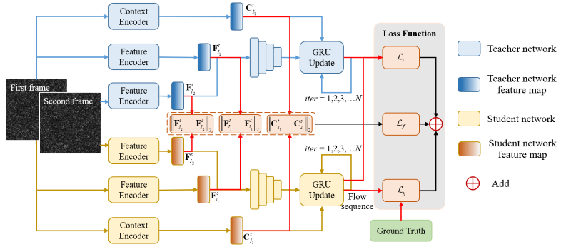
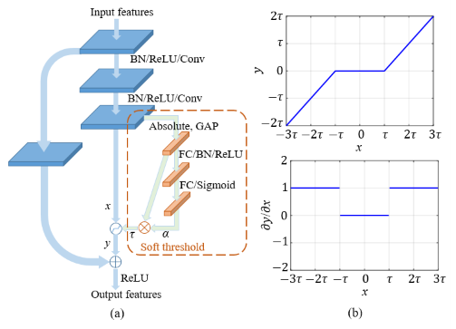

## A Lightweight Deep Optical Flow Network With Soft Threshold for Particle Image Velocimetry



## Overview
This is the official PyTorch implementation of "A Lightweight Deep Optical Flow Network With Soft Threshold for Particle Image Velocimetry" (LRAFT-ST). 
PIV is a key approach in experimental fluid dynamics and of fundamental importance in diverse applications, including automotive, aerospace, and biomedical engineering.
In this work, we propose a light deep optical flow network for learning displacement fields in an end-to-end manner, focusing on the specific case of Particle Image Velocimetry (PIV).
Our lightweight model is optimized under the teacher-student framework, where the distillation losse contain hard losse, soft losse and feature losse.
In addition, in order to improve the noise immunity of the model, we embedded the soft threshold unit into the network:



Our model is constructed in the RAFT framework. The underpinning optical flow architecture RAFT was provided by the authors **Zachary Teed** (Princeton University) and **Jia Deng** (Princeton University):
[Recurrent All Pairs Field Transforms for Optical Flow (github)](https://github.com/princeton-vl/RAFT).

We also referred to PIV-RAFT, which is an application of the [PIV-RAFT](https://codeocean.com/capsule/7226151/tree/v1) network in complex fluid estimation based on Particle Image Velocimetry (PIV).


## Requirements
The code has been tested with PyTorch 1.12 and Cuda 11.3.
```Shell
conda install pytorch==1.12.0 cudatoolkit=11.3 -c pytorch -c conda-forge
pip install tensorboard==2.4.1 --no-cache-dir
pip install tqdm==4.63.1 --no-cache-dir
pip install scipy
conda install hdf5storage -c conda-forge
pip install pillow
```
## Pretrained models
Pretrained models can be found in [Model](https://drive.google.com/drive/folders/1ecU_EHwZI3_cBXVXnpwOgTYineaQa1uq?usp=sharing). Several pretrained models are available:
* LRAFT-ST_KD_Lh_Ls_Lf-Dataset1 (student model): LRAFT-ST model pretrained on the training dataset 1 with knowledge distillation (hard loss, soft loss, and feature loss)
* LRAFT-ST_KD_Lh_Ls_Lf-Dataset2 (student model): LRAFT-ST model pretrained on the training dataset 2 with knowledge distillation (hard loss, soft loss, and feature loss)
* RAFT_4-ST-Dataset1 (teacher model): RAFT (1/4 resolution) with channel threshold model pretrained on the training dataset 1 with hard loss
* RAFT_4-ST-Dataset2 (teacher model): RAFT (1/4 resolution) with channel threshold model pretrained on the training dataset 2 with hard loss
* The pre-trained model of PIV-RAFT can be found in [PIV-RAFT](https://codeocean.com/capsule/7226151/tree/v1).

You can download these pre-trained models and place them in the folder `./precomputed_ckpts/`.
## Required Data
To train LRAFT-ST, you will need to download the required datasets. Minimal training and validation datasets of dataset 1 & 2 can be found in `/data`. 
* [Dataset 1](https://github.com/shengzesnail/PIV_dataset)

* [Dataset 2](https://zenodo.org/record/4432496#.YMmLT6gzZaQ)

Several synthetic and experimental measurement test cases are provided:
* Test data for Dataset1 
* Test data for Dataset2 
* Flow over periodic hills ('PIV_4B'). This is a series of experimental images, and you can download it from [PIV_4B](http://www.pivchallenge.org/pivchallenge4.html#case_b).

## Evaluation

To evaluate a pretrained LRAFT-ST model use `evaluate.py`. The following command shows an example for the 'cylinder' test case using a model pretrained on Problem Class 1:
```Shell
python evaluate.py  --gpu 0 --arch LRAFT-ST --channel_threshold True --iters 12 --input_path_ckpt ./precomputed_ckpts/LRAFT-ST_KD_Lh_Ls_Lf-Dataset1/ckpt.tar --test 1 --test_dataset cylinder --split_size 5
```
The following command shows an example for the 'PIV_4B' test case using a model pretrained on Problem Class 2:
```Shell
python evaluate.py  --gpu 0 --arch LRAFT-ST --channel_threshold True --iters 12 --input_path_ckpt ./precomputed_ckpts/LRAFT-ST_KD_Lh_Ls_Lf-Dataset2/ckpt.tar --test 1 --test_dataset PIV_4B  --split_size 5 --offset 256
```
This is an example result in the case of 'PIV_4B', from left to right are the results of HS (a classical optical flow approach), LRAFT, and LRAFT-ST.


## Training
You can train a new LRAFT-ST model from scratch using the following command. It trains a model for 50 epochs using the Dataset 1 training and validation dataset with a batch size of 6:
```Shell
python train.py --gpu 0 --arch LRAFT-ST --name LRAFT-ST_newModel_Dataset_1 --channel_threshold True --kd True --input_teacher ./precomputed_ckpts/RAFT_4-ST-Dataset1/ckpt.tar --batch_size 6 --epochs 50 --iters 12 --l2 True --l2_factor 0.0001 --ls True --ls_factor 0.1 --lf True --lf_factor 0.0001 --dataset dataset1 --recover False 
```
